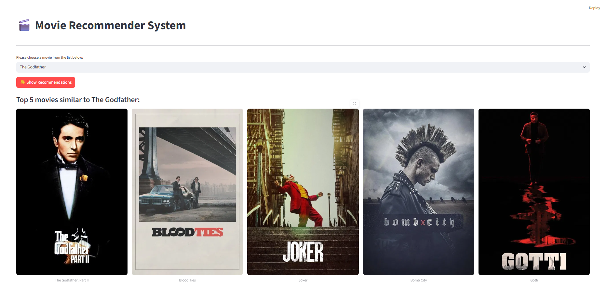

#  Movie Recommender System (Content-Based)

This is a **Content-Based Movie Recommender System** built using **Python**, the **Scikit-learn** library for machine learning, and **Streamlit** for the web application interface.

The system suggests movies that are similar to a user's chosen title based on the analysis of the movie's overview (plot summary) and genres.

##  Features

* **Content-Based Filtering:** Uses **Cosine Similarity** to measure the similarity between movies' text features (tags).
* **Interactive Web App:** Developed with **Streamlit** for a simple and responsive user interface.
* **Poster Integration:** Fetches real movie posters and metadata using the **TMDb API**.
* **Secure Configuration:** Uses the **`python-dotenv`** library to keep sensitive API keys separate from the source code.

##  How It Works

1.  **Vectorization:** Movie tags (overview + genres) are converted into numerical vectors using `CountVectorizer`.
2.  **Similarity Matrix:** A large matrix is computed using `cosine_similarity` to determine how close every movie is to every other movie.
3.  **Recommendation:** When a user selects a movie, the system looks up the top 5 closest vectors in the similarity matrix and returns the corresponding movie titles and posters.

##  Output Screenshot

Here is an example of the recommendations generated when searching for "The Godfather":

    

## 🛠️ Installation and Setup

### 1. Prerequisites

You need to have Python installed. You also require an **API Key** from [The Movie Database (TMDb) website](https://www.themoviedb.org/documentation/api) to fetch movie posters.

### 2. Get the Code and Data

Clone this repository and ensure you have the required CSV data file (e.g., `top10K-TMDB-movies.csv`) in the root directory.

### 3. Install Dependencies

Install all necessary Python packages:

pip install -r requirements.txt

### 4. Configure Environment Variables

Create a file named .env in the root directory of your project (and make sure you add it to your .gitignore file!).

In this file, set your TMDb API key:

Code snippet

# .env file
TMDB_API_KEY="YOUR_ACTUAL_TMDB_API_KEY_HERE"

### 5. Prepare the Model Files
Run the model preparation script to process the data, calculate the similarity matrix, and save the necessary .pkl files (movies_list.pkl and similarity.pkl):

python model_prep.py

### 6. Run the Application
Start the Streamlit web application:

streamlit run app.py
The application will open in your default web browser (usually at http://localhost:8501).

